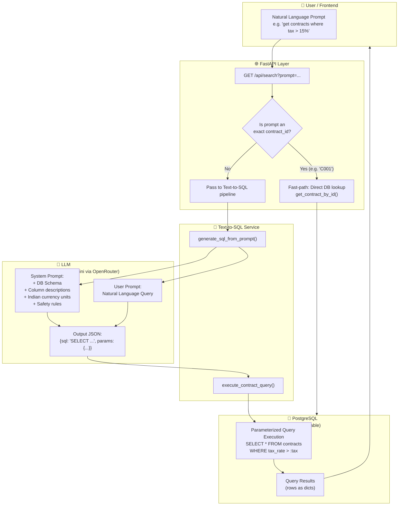
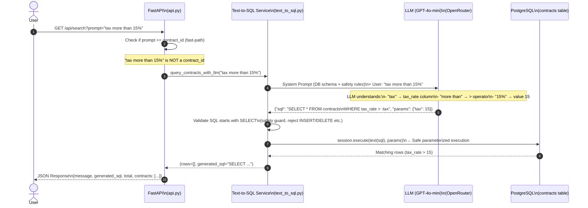

# Agent

---

# Text-to-SQL Architecture

## High-Level Overview



---

## Detailed Step-by-Step Flow



---

## What the LLM Receives (Context)

```
┌──────────────────────────────────────────────────────────────┐
│                    LLM INPUT (System Prompt)                  │
├──────────────────────────────────────────────────────────────┤
│                                                               │
│  Table: contracts                                             │
│  Columns:                                                     │
│    contract_id      TEXT     (e.g. "C001", "C_CONS_BEBF")    │
│    contract_name    TEXT     (project name)                   │
│    contract_amount  NUMERIC  (in Rupees)                      │
│    tax_rate         NUMERIC  (e.g. 18.0 = 18%)               │
│    start_date       DATE     (YYYY-MM-DD)                     │
│    end_date         DATE     (completion date)                │
│    file_url         TEXT     (document path)                  │
│    created_at       DATE     (when saved in DB)               │
│                                                               │
│  Indian Currency:                                             │
│    1 Lakh  = 100,000                                          │
│    1 Crore = 10,000,000                                       │
│                                                               │
│  RULES:                                                       │
│    ✅ Use :name style params (e.g. :amount, :tax)             │
│    ✅ Only generate SELECT queries                             │
│    ✅ Return JSON: {"sql": "...", "params": {...}}             │
│    ❌ Never INSERT, UPDATE, DELETE, DROP                       │
│    ❌ Never inline values directly into SQL                    │
│                                                               │
└──────────────────────────────────────────────────────────────┘
                              +
┌──────────────────────────────────────────────────────────────┐
│                    LLM INPUT (User Message)                   │
├──────────────────────────────────────────────────────────────┤
│  "get contracts where tax is more than 15%"                   │
└──────────────────────────────────────────────────────────────┘
```

---

## What the LLM Outputs

```
┌──────────────────────────────────────────────────────────────┐
│                    LLM OUTPUT (JSON)                          │
├──────────────────────────────────────────────────────────────┤
│  {                                                            │
│    "sql": "SELECT * FROM contracts                            │
│             WHERE tax_rate > :tax",                           │
│    "params": {                                                │
│       "tax": 15                                               │
│    }                                                          │
│  }                                                            │
└──────────────────────────────────────────────────────────────┘
```

---

## Safety Layer (SQL Injection Protection)

```
User Input          LLM Output                  PostgreSQL Execution
─────────           ──────────                  ────────────────────
"15%"     ──────►  sql    = "WHERE tax_rate > :tax"   ◄─── Value bound
                   params = {"tax": 15}          ──────────────────
                                                 Treats 15 as DATA,
                                                 not as SQL command ✅

                   ❌ NEVER:
                   "WHERE tax_rate > 15"  (inline string = SQL injection risk)
```

---

## Example Prompt Translations

| User Natural Language Prompt | LLM Generated SQL |
|---|---|
| `"tax is more than 15%"` | `SELECT * FROM contracts WHERE tax_rate > :tax` → `{tax: 15}` |
| `"amount more than 2 crore"` | `SELECT * FROM contracts WHERE contract_amount > :amount` → `{amount: 20000000}` |
| `"completing in 5 days"` | `SELECT * FROM contracts WHERE end_date <= CURRENT_DATE + INTERVAL '5 days'` |
| `"Hoskote contracts"` | `SELECT * FROM contracts WHERE contract_name ILIKE :name` → `{name: '%Hoskote%'}` |
| `"top 3 by amount"` | `SELECT * FROM contracts ORDER BY contract_amount DESC LIMIT 3` |
| `"created after Sept 2026"` | `SELECT * FROM contracts WHERE created_at > :date` → `{date: '2026-09-01'}` |
| `"C001"` | *(Fast-path: skips LLM, direct DB lookup)* |
